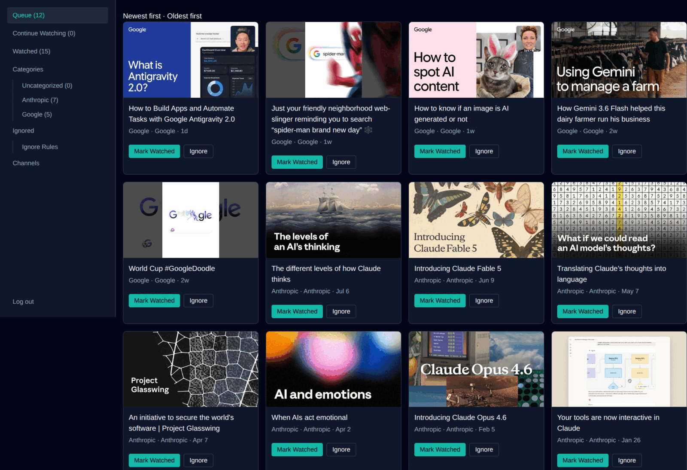

# Tubeshelf

[](https://github.com/jonrus/Tubeshelf/actions/workflows/pr.yml)


A self-hosted YouTube subscription tracker — a queue-based alternative to the YouTube
Subscriptions page, with per-channel categories, unwatched/watching/watched status
tracking, and keyword-based noise filtering. Videos are still watched on youtube.com
itself (not embedded), so ad-blocking and SponsorBlock in your own browser keep working
normally.

See `docs/app_idea.md` for the full product spec.

## Features

- Subscribe to YouTube channels via RSS — no YouTube Data API key required
- Organize channels into free-text categories
- Unwatched / Watching / Watched tracking, with a dedicated Watching page
- Keyword-based Ignore rules to auto-filter noise (e.g. Shorts)
- Category-filtered Queue, Continue Watching, Watched, and Ignored views



## Development

This project runs inside a devcontainer (`.devcontainer/devcontainer.json`), based on the
`oven/bun:1` image, since `bun` isn't installed on the host. On this project's dev machines
(Bazzite/Fedora), the Dev Containers extension is already configured to use **podman**
rather than Docker as its backend — no extra setup is needed beyond that.

1. Open the repo in your editor and reopen it in the devcontainer (Dev Containers
   extension).
2. Install dependencies:
   ```
   bun install
   ```
3. Start the dev server (Hono with hot reload + Tailwind watcher):
   ```
   bun run dev
   ```
   The app listens on [http://localhost:3000](http://localhost:3000).
4. Run tests:
   ```
   bun test
   ```

## Deployment

See `docs/DEPLOYMENT.md` for running Tubeshelf as a self-hosted Docker Compose service.

## License

GPLv3 — see [LICENSE](LICENSE).
